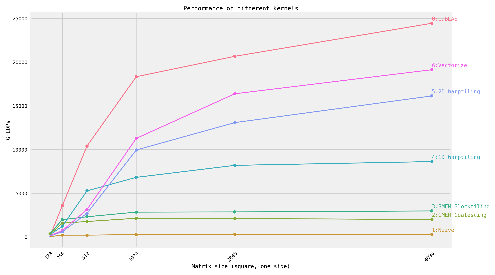

# Fast CUDA SGEMM from Scratch

Step-by-step optimization of matrix multiplication, implemented in CUDA.
For an explanation of each kernel, see [siboehm.com/CUDA-MMM](https://siboehm.com/articles/22/CUDA-MMM).
This repo is inspired by [wangzyon/NVIDIA_SGEMM_PRACTICE](https://github.com/wangzyon/NVIDIA_SGEMM_PRACTICE).

## Overview

Running the kernels on a NVIDIA A100 (Ampere):



GFLOPs at matrix size 4092x4092:
<!-- benchmark_results -->
| Kernel                              |   GFLOPs/s | Performance relative to cuBLAS   |
|:------------------------------------|-----------:|:---------------------------------|
| 1: Naive                            |      226.9 | 1.5%                             |
| 2: GMEM Coalescing                  |     2516.7 | 17.0%                            |
| 3: SMEM Caching                     |     4158.3 | 28.1%                            |
| 4: 1D Blocktiling                   |     8162.2 | 55.2%                            |
| 5: 2D Blocktiling                   |    11355.8 | 76.7%                            |
| 8: Avoid Bank Conflicts (Offset)    |    11646.9 | 78.7%                            |
| 7: Avoid Bank Conflicts (Linearize) |    11923.9 | 80.6%                            |
| 6: Vectorized Mem Access            |    12088.9 | 81.7%                            |
| 9: Autotuning                       |    12715.3 | 85.9%                            |
| 10: Warptiling                      |    12828.0   | 86.7%                            |
| 0: cuBLAS                           |    14797.8 | 100.0%                           |
<!-- benchmark_results -->

## Setup

1. Install dependencies: CUDA toolkit, Python (+ Seaborn), CMake, Ninja. See [environment.yml](environment.yml).
1. Configure NVCC compilation parameters. Look up your GPUs compute
   capability [here](https://developer.nvidia.com/cuda-gpus). Then configure the `CMakeLists.txt` and change:
    ```cmake
    set(CUDA_COMPUTE_CAPABILITY 80)
    ```
1. Build: `make`
1. Run one of the kernels: `DEVICE=<device_id> ./sgemm <kernel number>`
1. Profiling via [NVIDIA Nsight Compute](https://developer.nvidia.com/nsight-compute) (ncu): `make profile KERNEL=<kernel number>`